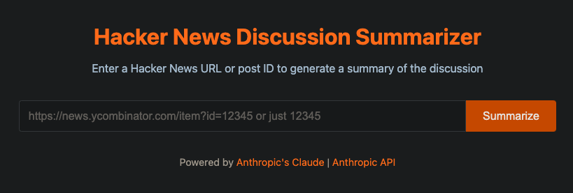

# Hacker News Discussion Summarizer

A web application that summarizes Hacker News discussions using the Anthropic API.



## Features

- Simple, clean interface for entering Hacker News URLs
- Accepts full HN URLs or just item IDs
- Fetches and parses HN discussion threads
- Summarizes discussions with thematic organization
- Renders results in formatted markdown
- Dockerized deployment for easy setup
- Allows for downloading the result as Markdown

## Setup

### Prerequisites

- Docker and Docker Compose
- Anthropic API key

### Configuration

1. Clone this repository:
   ```
   git clone https://github.com/samayethali/hacker-news-summary.git
   cd hacker-news-summary
   ```

2. Configure your environment variables:
   - Rename `.env.example` to `.env`
   - Edit the `.env` file in the root directory
   - Set your Anthropic API key: `ANTHROPIC_API_KEY=your_api_key_here`
   - Optionally set the model: `ANTHROPIC_MODEL=claude-3-7-sonnet-20250219` (defaults to `claude-3-5-haiku-20241022` if not specified)

### Docker Deployment

1. Build and start the services:
   ```
   docker compose --profile prod up -d
   ```

2. Access the application:
   - Open your browser and navigate to `http://localhost:8080`

3. To stop the services:
   ```
   docker compose --profile prod down
   ```

## API Endpoints

- `POST /summarize`: Accepts a JSON payload with a `url` field containing a Hacker News URL or item ID

## Project Structure

```
hacker-news-summary/
├── .env                   # Environment variables
├── docker-compose.yml     # Docker Compose configuration
├── backend/
│   ├── main.py            # FastAPI application
│   ├── requirements.txt   # Dependencies
│   └── Dockerfile         # Backend Docker configuration
├── frontend/
│   ├── index.html         # HTML interface
│   ├── styles.css         # Styling
│   ├── script.js          # Frontend logic
│   └── Dockerfile         # Frontend Docker configuration
└── README.md              # This file
```
